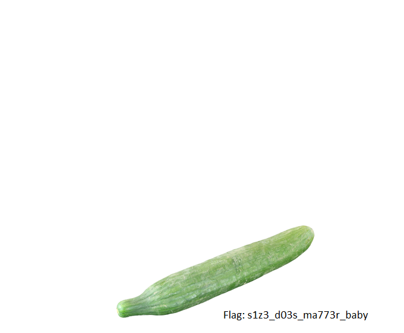

# CTF Writeup - Chronos CTF (IIT Mandi)

## Challenge: Size Doesn't Matter

### Category: Misc

### Writeup Author: iamgreedy

### Challenge Description

> Maybe she lied...

### Given File

- `m100.png`

### Solution

The challenge title "Size Doesn't Matter" and the give description suggested that the image might have incorrect dimensions, making it unreadable or corrupted. PNG files store their width and height in the IHDR chunk, and if these values are incorrect, the image won’t render properly.

To fix this, I used the this [tool](https://github.com/cjharris18/png-dimensions-bruteforcer), which attempts to brute-force correct dimensions for a PNG file.

After running the script, the image was successfully restored:

#### Fixed Image:


### Extracted Flag

```
saic{s1z3_d03s_ma773r_baby}
```

