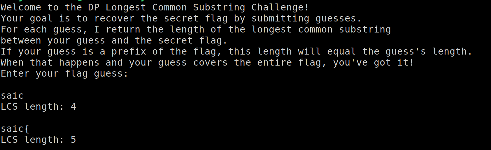

# CTF Writeup - Chronos CTF (IIT Mandi)

## Challenge: Crazy-LCS

### Category: MISC

### Writeup Author: iamgreedy

### Challenge Description

> The server plays hot-and-cold with your guesses—only telling you how much contiguous chunk matches the flag. No hints, no mercy, just pain. Can you piece it together, or will you substring yourself into madness? 😈🔍

### Given Connection

- `nc iitmandi.co.in 8098`

### Solution

The server provides the length of the **Longest Common Substring (LCS)** between a guessed string and the hidden flag. To reconstruct the flag:

1. Start with "saic{"
2. Guess characters iteratively, checking the LCS length.
3. If LCS increases, retain the guessed character.
4. Continue until the flag is fully revealed.



The following script automates this process:

```python
import string
import socket
import re

HOST = "iitmandi.co.in"
PORT = 8098
charset = string.ascii_letters + string.digits + "_"
flag = "saic{"

def send_guess(guess):
    with socket.socket(socket.AF_INET, socket.SOCK_STREAM) as s:
        s.connect((HOST, PORT))
        s.recv(1024)
        s.sendall(guess.encode() + b"\n")
        response = s.recv(1024).decode().strip()
        match = re.search(r"LCS length: (\d+)", response)
        return int(match.group(1)) if match else 0

current_length = 5

while True:
    best_char = None
    for c in charset:
        test_flag = flag + c
        match_length = send_guess(test_flag)
        if match_length > current_length:
            best_char = c
            current_length = match_length
            break
    if best_char:
        flag += best_char
        print(f"[+] Found so far: {flag}")
        if best_char == "}":
            break
    else:
        print("[-] No progress, exiting...")
        break
flag += "}"
print(f"Flag: {flag} ")
```

### Extracted Flag

```
saic{3asy_dp_lc5_ch4ll3ng3}
```

